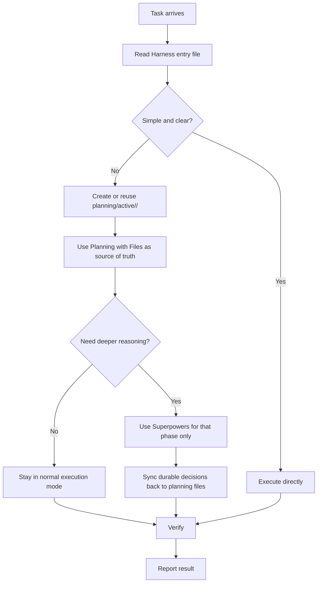
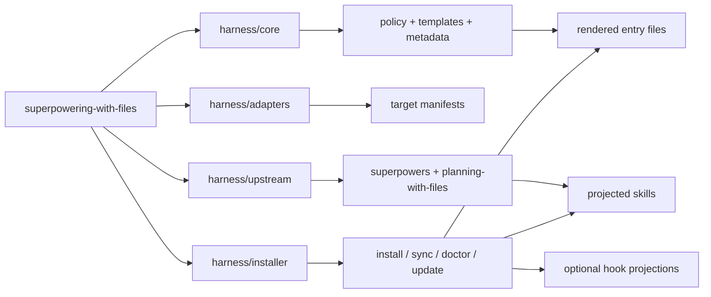

# superpowering-with-files

superpowering-with-files is a governance harness for local coding-agent workflows. It turns one shared policy into native instruction files, projected skills, and optional hooks for Codex, GitHub Copilot, Cursor, and Claude Code.

- `planning-with-files` owns durable task state.
- `superpowers` stays optional and temporary.
- Harness renders the same policy into each IDE's native shape.
- `safety` is opt-in for bypass / autopilot / long-running work.

Gemini CLI is not currently a supported installer target.

## Core Model



### Task State

| Path | Role |
| --- | --- |
| `planning/active/<task-id>/task_plan.md` | active plan, phases, lifecycle |
| `planning/active/<task-id>/findings.md` | durable findings and constraints |
| `planning/active/<task-id>/progress.md` | session log, checks, changed files |
| `planning/archive/<timestamp>-<task-id>/` | closed tasks after lifecycle guard passes |

Rules:

1. `planning-with-files` is the only durable task-memory system.
2. Tracked tasks must use `planning/active/<task-id>/` even when implementation is straightforward.
3. Deep-reasoning work may use `superpowers`, but only as a temporary reasoning layer.
4. When Superpowers is actually used, the detailed companion plan lives in `docs/superpowers/plans/<date>-<task-id>.md` and syncs back to the active task.

## Quick Start

```bash
# workspace
./scripts/harness install --scope=workspace --targets=all --projection=link
./scripts/harness sync
./scripts/harness doctor

# user-global bootstrap / refresh
./scripts/harness adopt-global
./scripts/harness adoption-status
```

Notes:

- Rendered entry files default to the `always-on-core` profile.
- Use `--scope=both` when you want a shared user-global baseline plus repo-local entry files.
- Use `--skills-profile=minimal-global` only when you intentionally want the smaller user-global projection.

## Common Flows

### Verify a change

```bash
npm run verify
./scripts/harness verify --output=.harness/verification
./scripts/harness sync --dry-run
./scripts/harness doctor --check-only
```

### Update upstream baselines

```bash
./scripts/harness fetch
./scripts/harness update
```

### Enable hooks or safety

```bash
./scripts/harness install --scope=workspace --targets=all --projection=link --hooks=on
./scripts/harness install --scope=workspace --profile=safety --hooks=on
./scripts/harness sync
./scripts/harness doctor --check-only
```

## Repository Structure



- `harness/core`: policy, templates, schemas, projection metadata
- `harness/adapters`: target-specific manifests
- `harness/installer`: CLI commands, state, projection logic, health checks
- `harness/upstream`: vendored `superpowers` and `planning-with-files` baselines

## Projection Map

### Entry Files

| Target | Workspace entry | User-global entry |
| --- | --- | --- |
| Codex | `AGENTS.md` | `~/.codex/AGENTS.md` |
| GitHub Copilot | `.github/copilot-instructions.md` | `~/.copilot/instructions/harness.instructions.md` |
| Cursor | `.cursor/rules/harness.mdc` | user rules in Cursor settings |
| Claude Code | `CLAUDE.md` | `~/.claude/CLAUDE.md` |

### Skill Roots

| Target | Workspace skill root | User-global skill root | Strategy |
| --- | --- | --- | --- |
| Codex | `.agents/skills` | `~/.agents/skills` | materialized |
| GitHub Copilot | `.agents/skills` | `~/.agents/skills` | materialized |
| Cursor | `.cursor/skills` | `~/.cursor/skills` | materialized |
| Claude Code | `.claude/skills` | `~/.claude/skills` | materialized |

Shared skill roots are limited to Codex and GitHub Copilot. Claude Code and Cursor keep platform-native skill directories.

## Safety

The `safety` profile adds path-boundary checks, automatic checkpoints, and a worktree-first flow for risky or long-running agent sessions.

```bash
./scripts/harness worktree-preflight --task <task-id> --safety
./scripts/harness checkpoint-push --message="..."
```

More detail:

- [Safety architecture](docs/safety/architecture.md)
- [Vibe coding safety manual](docs/safety/vibe-coding-safety-manual.md)
- [Recovery playbook](docs/safety/recovery-playbook.md)

## Commands

```bash
./scripts/harness install
./scripts/harness sync
./scripts/harness doctor
./scripts/harness status
./scripts/harness fetch
./scripts/harness update
./scripts/harness verify --output=.harness/verification
./scripts/harness adopt-global
./scripts/harness adoption-status
./scripts/harness summary
./scripts/harness summary --task <task-id>
./scripts/harness worktree-preflight
./scripts/harness worktree-preflight --task <task-id>
./scripts/harness worktree-preflight --safety
./scripts/harness worktree-name --task <task-id> --namespace <prefix>
./scripts/harness checkpoint <path>
./scripts/harness checkpoint-push --message="..."
./scripts/harness cloud-bootstrap --target=codespaces
./scripts/harness link-personal --repo=<git-url>
```

## Docs

- [Architecture](docs/architecture.md)
- [Roadmap](docs/roadmap.md)
- [Maintenance](docs/maintenance.md)
- [Release](docs/release.md)
- [Platform support](docs/install/platform-support.md)
- [Codex installation](docs/install/codex.md)
- [GitHub Copilot installation](docs/install/copilot.md)
- [Cursor installation](docs/install/cursor.md)
- [Claude Code installation](docs/install/claude-code.md)
- [Safety architecture](docs/safety/architecture.md)
- [Vibe coding safety manual](docs/safety/vibe-coding-safety-manual.md)
- [Recovery playbook](docs/safety/recovery-playbook.md)

## Upstream, License, Credit

Harness vendors two upstream systems and adds stricter local governance on top.

| Upstream | Original role | License | Harness usage |
| --- | --- | --- | --- |
| [`superpowers`](https://github.com/obra/superpowers) | agentic skills framework and workflow | MIT | optional reasoning layer for deep-reasoning phases |
| [`planning-with-files`](https://github.com/OthmanAdi/planning-with-files) | persistent markdown planning and session recovery | MIT | the only durable task-memory system |

Thanks to the upstream authors and communities whose work this repository builds on.
