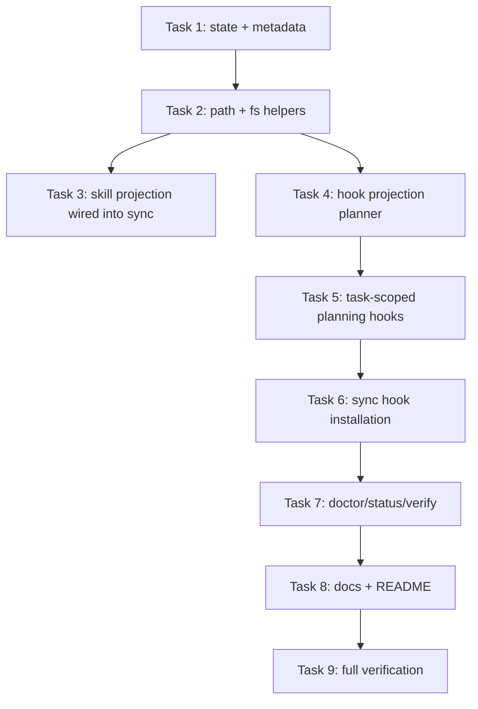

# Cross-IDE Hooks Projection Implementation Plan

> **For agentic workers:** REQUIRED SUB-SKILL: Use superpowers:subagent-driven-development (recommended) or superpowers:executing-plans to implement this plan task-by-task. Steps use checkbox (`- [ ]`) syntax for tracking.

**Goal:** 为 HarnessTemplate 增加跨 IDE 的 skills/hooks 投射能力，并让 `superpowers` 与 `planning-with-files` 的 upstream hook 能通过 Harness-owned adapter 安全安装到 Codex、GitHub Copilot、Cursor 和 Claude Code。

**Architecture:** `harness/upstream/*` 继续保持可替换 upstream baseline；所有路径转换、task-scoped planning 适配和 hook 安装逻辑放在 `harness/core` 与 `harness/installer`。`sync` 继续负责入口文件渲染，并新增 skills projection；hooks projection 默认关闭，只在 state 中显式开启时安装。

**Tech Stack:** Node.js ESM, `node:test`, JSON metadata, POSIX shell scripts, PowerShell-compatible extension points, Harness CLI.

---

## Current State

Status: active
Archive Eligible: no
Close Reason:

## Worktree Context

- Worktree base: `dev @ 50b74ab2deca894e62810096b8c41b18336f5ad2`
- 实现前如果要创建隔离 worktree，执行：

```bash
./scripts/harness worktree-preflight
git worktree add <path> -b codex/cross-ide-hooks-projection dev
```

## Finishing Criteria

- 默认 `./scripts/harness install --targets=<...>` 不安装 hooks。
- 显式 `./scripts/harness install --targets=<...> --hooks=on` 后，`sync` 会安装对应 target 的 hooks。
- `sync` 会按 skill metadata 投射 `superpowers` 与 `planning-with-files`。
- `planning-with-files` hooks 读取 `planning/active/<task-id>/...`，不读项目根目录 `task_plan.md`。
- `npm run verify` 通过。
- README 和 compatibility docs 更新，清楚说明默认行为、显式 hooks 开关、支持矩阵和限制。

## File Structure

- Modify: `harness/core/metadata/platforms.json`  
  增加每个 target 的 `skillRoots` 和 `hookRoots`，避免路径硬编码散落在 installer 里。
- Modify: `harness/core/skills/index.json`  
  增加 hooks projection metadata，声明每个 skill/target 的 hook source、strategy 和 adapter 类型。
- Create: `harness/core/hooks/planning-with-files/task-scoped-hook.sh`  
  Harness-owned wrapper，解析 active task 并提供 `user-prompt-submit`、`pre-tool-use`、`post-tool-use`、`stop`、`error-occurred` 子命令。
- Create: `harness/installer/lib/hook-projection.mjs`  
  根据 target、skill、scope 和 `hookMode` 解析 hook 安装计划。
- Modify: `harness/installer/lib/skill-projection.mjs`  
  从只返回策略，扩展为返回 target install path；保留现有 API 或提供兼容 wrapper，避免破坏现有 tests。
- Modify: `harness/installer/lib/paths.mjs`  
  增加 `resolveSkillPaths`、`resolveHookPaths`，统一处理 workspace/user-global/both。
- Modify: `harness/installer/lib/fs-ops.mjs`  
  增加目录级 materialize/link、JSON 写入 helper；保留 symlink 替换语义。
- Modify: `harness/installer/lib/state.mjs`  
  增加可选 `hookMode: "off" | "on"`，默认 `off`，并保持旧 state 兼容。
- Modify: `harness/installer/commands/install.mjs`  
  支持 `--hooks=off|on`，默认 `off`。
- Modify: `harness/installer/commands/sync.mjs`  
  接入 skills projection；仅当 `hookMode === "on"` 时运行 hooks projection。
- Modify: `harness/installer/commands/status.mjs`、`doctor.mjs`、`verify.mjs`  
  输出并校验 hook mode 和投射结果。
- Modify: `README.md`、`docs/architecture.md`、`docs/compatibility/hooks.md`、`docs/install/*.md`  
  更新安装结构、支持矩阵、显式 hooks 开关、默认安全边界。
- Test: `tests/installer/paths.test.mjs`
- Test: `tests/installer/fs-ops.test.mjs`
- Test: `tests/installer/state.test.mjs`
- Test: `tests/adapters/skill-projection.test.mjs`
- Create: `tests/adapters/hook-projection.test.mjs`
- Modify: `tests/adapters/sync.test.mjs`
- Create: `tests/adapters/sync-hooks.test.mjs`

## Task Graph



### Task 1: State And Metadata

**Files:**
- Modify: `harness/core/metadata/platforms.json`
- Modify: `harness/core/skills/index.json`
- Modify: `harness/installer/lib/state.mjs`
- Modify: `harness/installer/commands/install.mjs`
- Test: `tests/installer/state.test.mjs`
- Test: `tests/core/skill-index.test.mjs`

- [ ] **Step 1: Write failing state tests**

Add these tests to `tests/installer/state.test.mjs`:

```js
test('defaultState disables hook projection', () => {
  assert.equal(defaultState().hookMode, 'off');
});

test('writeState and readState roundtrip enabled hook mode', async () => {
  const dir = await mkdtemp(path.join(os.tmpdir(), 'harness-state-'));
  try {
    const state = {
      schemaVersion: 1,
      scope: 'workspace',
      projectionMode: 'link',
      hookMode: 'on',
      targets: { cursor: { enabled: true, paths: ['.cursor/rules/harness.mdc'] } },
      upstream: {}
    };

    await writeState(dir, state);
    assert.deepEqual(await readState(dir), state);
  } finally {
    await rm(dir, { recursive: true, force: true });
  }
});

test('readState treats missing hookMode as off for v1 compatibility', async () => {
  const dir = await mkdtemp(path.join(os.tmpdir(), 'harness-state-'));
  try {
    const stateFile = path.join(dir, '.harness', 'state.json');
    await mkdir(path.dirname(stateFile), { recursive: true });
    await writeFile(
      stateFile,
      JSON.stringify({
        schemaVersion: 1,
        scope: 'workspace',
        projectionMode: 'link',
        targets: { codex: { enabled: true, paths: ['AGENTS.md'] } },
        upstream: {}
      })
    );

    const state = await readState(dir);
    assert.equal(state.hookMode, 'off');
  } finally {
    await rm(dir, { recursive: true, force: true });
  }
});

test('writeState rejects invalid hook mode', async () => {
  const dir = await mkdtemp(path.join(os.tmpdir(), 'harness-state-'));
  try {
    await assert.rejects(
      writeState(dir, {
        schemaVersion: 1,
        scope: 'workspace',
        projectionMode: 'link',
        hookMode: 'always',
        targets: {},
        upstream: {}
      }),
      /hookMode must be off or on/
    );
  } finally {
    await rm(dir, { recursive: true, force: true });
  }
});
```

- [ ] **Step 2: Run state tests and verify they fail**

Run:

```bash
npm run test -- tests/installer/state.test.mjs
```

Expected: FAIL because `hookMode` is not accepted or defaulted.

- [ ] **Step 3: Update state model**

Modify `harness/installer/lib/state.mjs`:

```js
const STATE_KEYS = new Set([
  'schemaVersion',
  'scope',
  'projectionMode',
  'hookMode',
  'targets',
  'upstream',
  'lastSync',
  'lastFetch',
  'lastUpdate'
]);

export function defaultState() {
  return {
    schemaVersion: 1,
    scope: 'workspace',
    projectionMode: 'link',
    hookMode: 'off',
    targets: {},
    upstream: {}
  };
}

function normalizeStateShape(state) {
  return {
    ...state,
    hookMode: state.hookMode ?? 'off'
  };
}
```

Then in `readState`, parse and normalize before validation:

```js
export async function readState(rootDir) {
  try {
    const state = normalizeStateShape(JSON.parse(await readFile(statePath(rootDir), 'utf8')));
    validateStateShape(state);
    return state;
  } catch (error) {
    if (error && error.code === 'ENOENT') return defaultState();
    throw error;
  }
}
```

Add this validation to `validateStateShape` after projection mode validation:

```js
if (!['off', 'on'].includes(state.hookMode)) {
  throw new TypeError('Harness state hookMode must be off or on.');
}
```

- [ ] **Step 4: Update install command**

Modify `harness/installer/commands/install.mjs`:

```js
const hookMode = readOption(args, 'hooks', 'off');

if (!['off', 'on'].includes(hookMode)) {
  throw new Error(`Invalid hooks mode: ${hookMode}`);
}
```

Include `hookMode` in the state:

```js
const state = {
  schemaVersion: 1,
  scope,
  projectionMode,
  hookMode,
  targets: {},
  upstream: {}
};
```

- [ ] **Step 5: Update metadata**

Modify `harness/core/metadata/platforms.json` so each platform has path metadata:

```json
"codex": {
  "displayName": "Codex",
  "entryFiles": ["AGENTS.md"],
  "supportsGlobal": true,
  "supportsWorkspace": true,
  "skillsStrategy": "link-preferred",
  "skillRoots": { "workspace": ".codex/skills", "global": ".codex/skills" },
  "hookRoots": { "workspace": ".codex", "global": ".codex" }
}
```

Use these values for the other targets:

```json
"copilot": {
  "skillRoots": { "workspace": ".github/skills", "global": ".github/skills" },
  "hookRoots": { "workspace": ".github/hooks", "global": ".github/hooks" }
}
```

```json
"cursor": {
  "skillRoots": { "workspace": ".cursor/skills", "global": ".cursor/skills" },
  "hookRoots": { "workspace": ".cursor", "global": ".cursor" }
}
```

```json
"claude-code": {
  "skillRoots": { "workspace": ".claude/skills", "global": ".claude/skills" },
  "hookRoots": { "workspace": ".claude", "global": ".claude" }
}
```

- [ ] **Step 6: Add hook metadata to skill index**

Modify `harness/core/skills/index.json`:

```json
"hooks": {
  "claude-code": {
    "strategy": "materialize",
    "source": "harness/upstream/superpowers/hooks",
    "config": "hooks.json",
    "targetConfig": "hooks.json"
  },
  "cursor": {
    "strategy": "materialize",
    "source": "harness/upstream/superpowers/hooks",
    "config": "hooks-cursor.json",
    "targetConfig": "hooks.json"
  }
}
```

For `planning-with-files`, add:

```json
"hooks": {
  "codex": {
    "strategy": "materialize",
    "source": "harness/core/hooks/planning-with-files",
    "config": "codex-hooks.json",
    "targetConfig": "hooks.json"
  },
  "copilot": {
    "strategy": "materialize",
    "source": "harness/core/hooks/planning-with-files",
    "config": "copilot-hooks.json",
    "targetConfig": "planning-with-files.json"
  },
  "cursor": {
    "strategy": "materialize",
    "source": "harness/core/hooks/planning-with-files",
    "config": "cursor-hooks.json",
    "targetConfig": "hooks.json"
  },
  "claude-code": {
    "strategy": "materialize",
    "source": "harness/core/hooks/planning-with-files",
    "config": "claude-hooks.json",
    "targetConfig": "hooks.json"
  }
}
```

- [ ] **Step 7: Update core skill index test**

Add to `tests/core/skill-index.test.mjs`:

```js
assert.equal(index.skills.superpowers.hooks['claude-code'].config, 'hooks.json');
assert.equal(index.skills['planning-with-files'].hooks.copilot.targetConfig, 'planning-with-files.json');
```

- [ ] **Step 8: Run focused tests**

Run:

```bash
npm run test -- tests/installer/state.test.mjs tests/core/skill-index.test.mjs
```

Expected: PASS.

### Task 2: Path And Filesystem Projection Helpers

**Files:**
- Modify: `harness/installer/lib/paths.mjs`
- Modify: `harness/installer/lib/fs-ops.mjs`
- Test: `tests/installer/paths.test.mjs`
- Test: `tests/installer/fs-ops.test.mjs`

- [ ] **Step 1: Add failing path tests**

Add to `tests/installer/paths.test.mjs`:

```js
import { resolveHookRootPaths, resolveSkillRootPaths } from '../../harness/installer/lib/paths.mjs';

test('resolveSkillRootPaths returns workspace skill roots', () => {
  const paths = resolveSkillRootPaths('/repo', '/home/user', 'workspace', 'cursor');
  assert.deepEqual(paths, ['/repo/.cursor/skills']);
});

test('resolveHookRootPaths returns copilot workspace hook root', () => {
  const paths = resolveHookRootPaths('/repo', '/home/user', 'workspace', 'copilot');
  assert.deepEqual(paths, ['/repo/.github/hooks']);
});

test('resolveSkillRootPaths returns both codex roots', () => {
  const paths = resolveSkillRootPaths('/repo', '/home/user', 'both', 'codex');
  assert.deepEqual(paths, ['/repo/.codex/skills', '/home/user/.codex/skills']);
});
```

- [ ] **Step 2: Add failing fs tests**

Add to `tests/installer/fs-ops.test.mjs`:

```js
import { materializeDirectory } from '../../harness/installer/lib/fs-ops.mjs';
```

Then add:

```js
test('materializeDirectory copies nested files and replaces existing target', async () => {
  const dir = await mkdtemp(path.join(os.tmpdir(), 'harness-fs-'));
  try {
    const source = path.join(dir, 'source');
    const target = path.join(dir, 'target');
    await mkdir(path.join(source, 'nested'), { recursive: true });
    await writeFile(path.join(source, 'nested/file.txt'), 'nested content');
    await mkdir(target, { recursive: true });
    await writeFile(path.join(target, 'old.txt'), 'old content');

    await materializeDirectory(source, target);

    assert.equal(await readFile(path.join(target, 'nested/file.txt'), 'utf8'), 'nested content');
    await assert.rejects(readFile(path.join(target, 'old.txt'), 'utf8'), /ENOENT/);
  } finally {
    await rm(dir, { recursive: true, force: true });
  }
});
```

- [ ] **Step 3: Run tests and verify failure**

Run:

```bash
npm run test -- tests/installer/paths.test.mjs tests/installer/fs-ops.test.mjs
```

Expected: FAIL because helper functions do not exist.

- [ ] **Step 4: Implement path helpers**

Modify `harness/installer/lib/paths.mjs`:

```js
function resolveRootValues(target, key) {
  const platform = platforms[target];
  if (!platform) {
    throw new Error(`Unknown target: ${target}`);
  }

  const roots = platform[key];
  if (!roots) {
    throw new Error(`Target ${target} does not define ${key}`);
  }

  return roots;
}

function resolveScopedRootPaths(rootDir, homeDir, scope, target, metadataKey) {
  const roots = resolveRootValues(target, metadataKey);
  const results = [];

  if (scope === 'workspace' || scope === 'both') {
    results.push(path.join(rootDir, roots.workspace));
  }

  if (scope === 'user-global' || scope === 'both') {
    results.push(path.join(homeDir, roots.global));
  }

  return results;
}

export function resolveSkillRootPaths(rootDir, homeDir, scope, target) {
  return resolveScopedRootPaths(rootDir, homeDir, scope, target, 'skillRoots');
}

export function resolveHookRootPaths(rootDir, homeDir, scope, target) {
  return resolveScopedRootPaths(rootDir, homeDir, scope, target, 'hookRoots');
}
```

- [ ] **Step 5: Implement directory materialization**

Modify `harness/installer/lib/fs-ops.mjs` imports:

```js
import { cp, copyFile, mkdir, readFile, rm, symlink, writeFile } from 'node:fs/promises';
```

Add:

```js
export async function materializeDirectory(sourcePath, targetPath) {
  await replaceTargetPath(targetPath);
  await mkdir(path.dirname(targetPath), { recursive: true });
  await cp(sourcePath, targetPath, { recursive: true });
}

export async function projectPath(sourcePath, targetPath, strategy) {
  if (strategy === 'link') {
    await linkPath(sourcePath, targetPath);
    return;
  }

  if (strategy === 'materialize') {
    await materializeDirectory(sourcePath, targetPath);
    return;
  }

  throw new Error(`Unsupported projection strategy: ${strategy}`);
}
```

- [ ] **Step 6: Run focused tests**

Run:

```bash
npm run test -- tests/installer/paths.test.mjs tests/installer/fs-ops.test.mjs
```

Expected: PASS.

### Task 3: Skill Projection Wired Into Sync

**Files:**
- Modify: `harness/installer/lib/skill-projection.mjs`
- Modify: `harness/installer/commands/sync.mjs`
- Test: `tests/adapters/skill-projection.test.mjs`
- Modify: `tests/adapters/sync.test.mjs`

- [ ] **Step 1: Add failing skill projection test**

Add to `tests/adapters/skill-projection.test.mjs`:

```js
import path from 'node:path';
import { skillProjectionPlans } from '../../harness/installer/lib/skill-projection.mjs';

test('skillProjectionPlans returns target install paths for workspace scope', async () => {
  const plans = await skillProjectionPlans(process.cwd(), '/home/user', 'workspace', 'copilot');
  const planning = plans.find((plan) => plan.skillName === 'planning-with-files');

  assert.equal(planning.strategy, 'materialize');
  assert.equal(planning.target, path.join(process.cwd(), '.github/skills/planning-with-files'));
});
```

- [ ] **Step 2: Run test and verify failure**

Run:

```bash
npm run test -- tests/adapters/skill-projection.test.mjs
```

Expected: FAIL because `skillProjectionPlans` does not exist.

- [ ] **Step 3: Implement `skillProjectionPlans`**

Modify `harness/installer/lib/skill-projection.mjs`:

```js
import { resolveSkillRootPaths } from './paths.mjs';
```

Add:

```js
export async function skillProjectionPlans(rootDir, homeDir, scope, target) {
  const index = await readFile(path.join(rootDir, 'harness/core/skills/index.json'), 'utf8').then(JSON.parse);
  const roots = resolveSkillRootPaths(rootDir, homeDir, scope, target);
  const plans = [];

  for (const [skillName, skill] of Object.entries(index.skills)) {
    const strategy = skill.projection[target] || skill.projection.default;
    if (!strategies.has(strategy)) {
      throw new Error(`Unsupported projection strategy: ${strategy}`);
    }

    for (const root of roots) {
      plans.push({
        skillName,
        targetName: target,
        strategy,
        source: path.join(rootDir, skill.baselinePath),
        target: path.join(root, skillName),
        patch: skill.patches ? skill.patches[target] : undefined
      });
    }
  }

  return plans;
}
```

- [ ] **Step 4: Wire skill projection into sync**

Modify `harness/installer/commands/sync.mjs` imports:

```js
import { projectPath } from '../lib/fs-ops.mjs';
import { skillProjectionPlans } from '../lib/skill-projection.mjs';
```

After entry file rendering inside the target loop, add:

```js
for (const plan of await skillProjectionPlans(rootDir, homeDir, state.scope, target)) {
  await projectPath(plan.source, plan.target, plan.strategy);
}
```

- [ ] **Step 5: Extend sync test**

In `tests/adapters/sync.test.mjs`, add assertions inside the existing test after `await sync([])`:

```js
const skillPath = path.join(root, '.codex/skills/superpowers');
const skillStat = await lstat(skillPath);
assert.equal(skillStat.isSymbolicLink(), true);
```

Update imports:

```js
import { lstat, mkdir, readFile, rm, writeFile } from 'node:fs/promises';
```

In `finally`, remove the projected skill path:

```js
await rm(path.join(root, '.codex'), { recursive: true, force: true });
```

- [ ] **Step 6: Run focused tests**

Run:

```bash
npm run test -- tests/adapters/skill-projection.test.mjs tests/adapters/sync.test.mjs
```

Expected: PASS.

### Task 4: Hook Projection Planner

**Files:**
- Create: `harness/installer/lib/hook-projection.mjs`
- Test: `tests/adapters/hook-projection.test.mjs`

- [ ] **Step 1: Write failing hook projection tests**

Create `tests/adapters/hook-projection.test.mjs`:

```js
import { test } from 'node:test';
import assert from 'node:assert/strict';
import path from 'node:path';
import { hookProjectionPlans } from '../../harness/installer/lib/hook-projection.mjs';

test('hookProjectionPlans returns no plans when hooks are off', async () => {
  const plans = await hookProjectionPlans(process.cwd(), '/home/user', 'workspace', 'cursor', 'off');
  assert.deepEqual(plans, []);
});

test('hookProjectionPlans returns cursor planning hook config when hooks are on', async () => {
  const plans = await hookProjectionPlans(process.cwd(), '/home/user', 'workspace', 'cursor', 'on');
  const planning = plans.find((plan) => plan.skillName === 'planning-with-files');

  assert.equal(planning.configSource, path.join(process.cwd(), 'harness/core/hooks/planning-with-files/cursor-hooks.json'));
  assert.equal(planning.configTarget, path.join(process.cwd(), '.cursor/hooks.json'));
  assert.equal(planning.assetsSource, path.join(process.cwd(), 'harness/core/hooks/planning-with-files/scripts'));
  assert.equal(planning.assetsTarget, path.join(process.cwd(), '.cursor/hooks'));
});

test('hookProjectionPlans returns copilot planning hook config under .github/hooks', async () => {
  const plans = await hookProjectionPlans(process.cwd(), '/home/user', 'workspace', 'copilot', 'on');
  const planning = plans.find((plan) => plan.skillName === 'planning-with-files');

  assert.equal(planning.configTarget, path.join(process.cwd(), '.github/hooks/planning-with-files.json'));
});
```

- [ ] **Step 2: Run test and verify failure**

Run:

```bash
npm run test -- tests/adapters/hook-projection.test.mjs
```

Expected: FAIL because module does not exist.

- [ ] **Step 3: Implement planner**

Create `harness/installer/lib/hook-projection.mjs`:

```js
import { readFile } from 'node:fs/promises';
import path from 'node:path';
import { resolveHookRootPaths } from './paths.mjs';

const strategies = new Set(['materialize']);

export async function hookProjectionPlans(rootDir, homeDir, scope, target, hookMode) {
  if (hookMode !== 'on') return [];

  const index = await readFile(path.join(rootDir, 'harness/core/skills/index.json'), 'utf8').then(JSON.parse);
  const roots = resolveHookRootPaths(rootDir, homeDir, scope, target);
  const plans = [];

  for (const [skillName, skill] of Object.entries(index.skills)) {
    const hookConfig = skill.hooks ? skill.hooks[target] : undefined;
    if (!hookConfig) continue;

    if (!strategies.has(hookConfig.strategy)) {
      throw new Error(`Unsupported hook projection strategy: ${hookConfig.strategy}`);
    }

    for (const root of roots) {
      const sourceRoot = path.join(rootDir, hookConfig.source);
      plans.push({
        skillName,
        targetName: target,
        strategy: hookConfig.strategy,
        configSource: path.join(sourceRoot, hookConfig.config),
        configTarget: path.join(root, hookConfig.targetConfig),
        assetsSource: path.join(sourceRoot, 'scripts'),
        assetsTarget: path.join(root, 'hooks')
      });
    }
  }

  return plans;
}
```

- [ ] **Step 4: Run focused tests**

Run:

```bash
npm run test -- tests/adapters/hook-projection.test.mjs
```

Expected: FAIL until Task 5 adds the referenced hook assets; PASS after Task 5.

### Task 5: Task-Scoped Planning Hook Assets

**Files:**
- Create: `harness/core/hooks/planning-with-files/scripts/task-scoped-hook.sh`
- Create: `harness/core/hooks/planning-with-files/cursor-hooks.json`
- Create: `harness/core/hooks/planning-with-files/copilot-hooks.json`
- Create: `harness/core/hooks/planning-with-files/claude-hooks.json`
- Create: `harness/core/hooks/planning-with-files/codex-hooks.json`
- Test: `tests/adapters/hook-projection.test.mjs`

- [ ] **Step 1: Create shared hook script**

Create `harness/core/hooks/planning-with-files/scripts/task-scoped-hook.sh`:

```bash
#!/usr/bin/env bash
set -euo pipefail

event="${1:-}"
root="${HARNESS_PROJECT_ROOT:-$(pwd)}"
active_root="$root/planning/active"

latest_active_task() {
  if [ ! -d "$active_root" ]; then
    return 1
  fi

  for task_dir in "$active_root"/*; do
    [ -d "$task_dir" ] || continue
    plan="$task_dir/task_plan.md"
    [ -f "$plan" ] || continue
    if grep -q '^Status: active$' "$plan"; then
      printf '%s\n' "$task_dir"
      return 0
    fi
  done

  return 1
}

task_dir="$(latest_active_task || true)"

json_escape() {
  python3 -c 'import json,sys; print(json.dumps(sys.stdin.read(), ensure_ascii=False))'
}

emit_context() {
  context="$1"
  if [ -z "$context" ]; then
    printf '{}\n'
    return 0
  fi

  escaped="$(printf '%s' "$context" | json_escape)"
  printf '{"hookSpecificOutput":{"additionalContext":%s}}\n' "$escaped"
}

if [ -z "$task_dir" ]; then
  printf '{}\n'
  exit 0
fi

plan="$task_dir/task_plan.md"
progress="$task_dir/progress.md"
findings="$task_dir/findings.md"

case "$event" in
  user-prompt-submit|session-start)
    context="$(printf '[planning-with-files] ACTIVE PLAN\n'; head -50 "$plan"; printf '\n=== recent progress ===\n'; tail -20 "$progress" 2>/dev/null || true; printf '\nRead findings: %s\n' "$findings")"
    emit_context "$context"
    ;;
  pre-tool-use)
    context="$(head -30 "$plan" 2>/dev/null || true)"
    emit_context "$context"
    ;;
  post-tool-use)
    emit_context "[planning-with-files] Update $progress with what you just did. If a phase is now complete, update $plan status."
    ;;
  stop|agent-stop|session-end)
    if grep -q '^Status: closed$' "$plan" && grep -q '^Archive Eligible: yes$' "$plan"; then
      emit_context "[planning-with-files] Task is closed and archive eligible: $task_dir"
    else
      emit_context "[planning-with-files] Before stopping, update $progress and confirm whether $plan should remain active, become waiting_review, or be closed."
    fi
    ;;
  error-occurred)
    emit_context "[planning-with-files] An error occurred. Log the error, attempt, and resolution in $plan under Errors Encountered."
    ;;
  *)
    printf '{}\n'
    ;;
esac
```

- [ ] **Step 2: Create Cursor hook config**

Create `harness/core/hooks/planning-with-files/cursor-hooks.json`:

```json
{
  "version": 1,
  "hooks": {
    "userPromptSubmit": [
      {
        "command": ".cursor/hooks/task-scoped-hook.sh user-prompt-submit",
        "timeout": 5
      }
    ],
    "preToolUse": [
      {
        "command": ".cursor/hooks/task-scoped-hook.sh pre-tool-use",
        "matcher": "Write|Edit|Shell|Read",
        "timeout": 5
      }
    ],
    "postToolUse": [
      {
        "command": ".cursor/hooks/task-scoped-hook.sh post-tool-use",
        "matcher": "Write|Edit",
        "timeout": 5
      }
    ],
    "stop": [
      {
        "command": ".cursor/hooks/task-scoped-hook.sh stop",
        "timeout": 10,
        "loop_limit": 3
      }
    ]
  }
}
```

- [ ] **Step 3: Create GitHub Copilot hook config**

Create `harness/core/hooks/planning-with-files/copilot-hooks.json`:

```json
{
  "version": 1,
  "hooks": {
    "sessionStart": [
      {
        "type": "command",
        "bash": ".github/hooks/hooks/task-scoped-hook.sh session-start",
        "timeout": 15
      }
    ],
    "preToolUse": [
      {
        "type": "command",
        "bash": ".github/hooks/hooks/task-scoped-hook.sh pre-tool-use",
        "timeout": 5
      }
    ],
    "postToolUse": [
      {
        "type": "command",
        "bash": ".github/hooks/hooks/task-scoped-hook.sh post-tool-use",
        "timeout": 5
      }
    ],
    "agentStop": [
      {
        "type": "command",
        "bash": ".github/hooks/hooks/task-scoped-hook.sh agent-stop",
        "timeout": 10
      }
    ],
    "errorOccurred": [
      {
        "type": "command",
        "bash": ".github/hooks/hooks/task-scoped-hook.sh error-occurred",
        "timeout": 5
      }
    ]
  }
}
```

- [ ] **Step 4: Create Claude Code hook config**

Create `harness/core/hooks/planning-with-files/claude-hooks.json`:

```json
{
  "hooks": {
    "UserPromptSubmit": [
      {
        "hooks": [
          {
            "type": "command",
            "command": ".claude/hooks/task-scoped-hook.sh user-prompt-submit"
          }
        ]
      }
    ],
    "PreToolUse": [
      {
        "matcher": "Write|Edit|Bash|Read|Glob|Grep",
        "hooks": [
          {
            "type": "command",
            "command": ".claude/hooks/task-scoped-hook.sh pre-tool-use"
          }
        ]
      }
    ],
    "PostToolUse": [
      {
        "matcher": "Write|Edit",
        "hooks": [
          {
            "type": "command",
            "command": ".claude/hooks/task-scoped-hook.sh post-tool-use"
          }
        ]
      }
    ],
    "Stop": [
      {
        "hooks": [
          {
            "type": "command",
            "command": ".claude/hooks/task-scoped-hook.sh stop"
          }
        ]
      }
    ]
  }
}
```

- [ ] **Step 5: Create Codex hook config**

Create `harness/core/hooks/planning-with-files/codex-hooks.json`:

```json
{
  "hooks": {
    "SessionStart": [
      {
        "hooks": [
          {
            "type": "command",
            "command": ".codex/hooks/task-scoped-hook.sh session-start"
          }
        ]
      }
    ],
    "PreToolUse": [
      {
        "matcher": "Write|Edit|Bash|Read|Glob|Grep",
        "hooks": [
          {
            "type": "command",
            "command": ".codex/hooks/task-scoped-hook.sh pre-tool-use"
          }
        ]
      }
    ],
    "PostToolUse": [
      {
        "matcher": "Write|Edit",
        "hooks": [
          {
            "type": "command",
            "command": ".codex/hooks/task-scoped-hook.sh post-tool-use"
          }
        ]
      }
    ],
    "Stop": [
      {
        "hooks": [
          {
            "type": "command",
            "command": ".codex/hooks/task-scoped-hook.sh stop"
          }
        ]
      }
    ]
  }
}
```

- [ ] **Step 6: Run hook projection test**

Run:

```bash
npm run test -- tests/adapters/hook-projection.test.mjs
```

Expected: PASS.

### Task 6: Sync Hook Installation

**Files:**
- Modify: `harness/installer/commands/sync.mjs`
- Test: `tests/adapters/sync-hooks.test.mjs`

- [ ] **Step 1: Write failing sync hooks tests**

Create `tests/adapters/sync-hooks.test.mjs`:

```js
import { test } from 'node:test';
import assert from 'node:assert/strict';
import { mkdtemp, readFile, rm } from 'node:fs/promises';
import os from 'node:os';
import path from 'node:path';
import { writeState } from '../../harness/installer/lib/state.mjs';
import { sync } from '../../harness/installer/commands/sync.mjs';

async function withCwd(cwd, callback) {
  const previous = process.cwd();
  process.chdir(cwd);
  try {
    return await callback();
  } finally {
    process.chdir(previous);
  }
}

test('sync does not install hooks when hookMode is off', async () => {
  const root = await mkdtemp(path.join(os.tmpdir(), 'harness-sync-hooks-'));
  try {
    await writeState(root, {
      schemaVersion: 1,
      scope: 'workspace',
      projectionMode: 'link',
      hookMode: 'off',
      targets: { cursor: { enabled: true, paths: [path.join(root, '.cursor/rules/harness.mdc')] } },
      upstream: {}
    });

    await withCwd(root, () => sync([]));
    await assert.rejects(readFile(path.join(root, '.cursor/hooks.json'), 'utf8'), /ENOENT/);
  } finally {
    await rm(root, { recursive: true, force: true });
  }
});

test('sync installs cursor planning hooks when hookMode is on', async () => {
  const root = await mkdtemp(path.join(os.tmpdir(), 'harness-sync-hooks-'));
  try {
    await writeState(root, {
      schemaVersion: 1,
      scope: 'workspace',
      projectionMode: 'link',
      hookMode: 'on',
      targets: { cursor: { enabled: true, paths: [path.join(root, '.cursor/rules/harness.mdc')] } },
      upstream: {}
    });

    await withCwd(root, () => sync([]));
    const hooks = await readFile(path.join(root, '.cursor/hooks.json'), 'utf8');
    assert.match(hooks, /task-scoped-hook/);
    assert.match(await readFile(path.join(root, '.cursor/hooks/task-scoped-hook.sh'), 'utf8'), /planning\\/active/);
  } finally {
    await rm(root, { recursive: true, force: true });
  }
});
```

- [ ] **Step 2: Run test and verify failure**

Run:

```bash
npm run test -- tests/adapters/sync-hooks.test.mjs
```

Expected: FAIL because `sync` does not call hook projection.

- [ ] **Step 3: Implement sync hook projection**

Modify `harness/installer/commands/sync.mjs` imports:

```js
import { materializeDirectory, materializeFile, projectPath, writeRenderedFile } from '../lib/fs-ops.mjs';
import { hookProjectionPlans } from '../lib/hook-projection.mjs';
```

Add after skill projection:

```js
for (const plan of await hookProjectionPlans(rootDir, homeDir, state.scope, target, state.hookMode)) {
  await materializeFile(plan.configSource, plan.configTarget);
  await materializeDirectory(plan.assetsSource, plan.assetsTarget);
}
```

- [ ] **Step 4: Run focused sync tests**

Run:

```bash
npm run test -- tests/adapters/sync.test.mjs tests/adapters/sync-hooks.test.mjs
```

Expected: PASS.

### Task 7: Status, Doctor, Verify

**Files:**
- Modify: `harness/installer/commands/status.mjs`
- Modify: `harness/installer/commands/doctor.mjs`
- Modify: `harness/installer/commands/verify.mjs`
- Test: `tests/installer/state.test.mjs`
- Test: `tests/adapters/sync-hooks.test.mjs`

- [ ] **Step 1: Update `verify` output**

Modify `harness/installer/commands/verify.mjs`:

```js
hookMode: state.hookMode
```

in `checks`, and add to Markdown output:

```js
`Hook mode: ${report.checks.hookMode}`,
```

- [ ] **Step 2: Update `doctor` health checks**

Modify `harness/installer/commands/doctor.mjs` imports:

```js
import os from 'node:os';
import { hookProjectionPlans } from '../lib/hook-projection.mjs';
```

After entry path checks, add:

```js
for (const target of Object.keys(state.targets).filter((name) => state.targets[name].enabled)) {
  for (const plan of await hookProjectionPlans(process.cwd(), os.homedir(), state.scope, target, state.hookMode)) {
    try {
      await access(plan.configTarget);
    } catch {
      problems.push(`${target}: missing hook config ${plan.configTarget}`);
    }
  }
}
```

- [ ] **Step 3: Run command-level verification**

Run:

```bash
./scripts/harness verify
sed -n '1,40p' reports/verification/latest.md
```

Expected output includes:

```text
Hook mode: off
```

Then remove generated verification reports if they are not intended to be committed:

```bash
rm -f reports/verification/latest.json reports/verification/latest.md
```

### Task 8: README And Documentation

**Files:**
- Modify: `README.md`
- Modify: `docs/architecture.md`
- Modify: `docs/compatibility/hooks.md`
- Modify: `docs/install/codex.md`
- Modify: `docs/install/copilot.md`
- Modify: `docs/install/cursor.md`
- Modify: `docs/install/claude-code.md`

- [ ] **Step 1: Update README implementation note**

Replace the current note:

```md
Current implementation note: `sync` renders instruction entry files as real files. Skill projection strategies are modeled and tested, but skill filesystem projection is not wired into `sync` yet. There is no hard-link implementation; the filesystem helpers support real files and symlinks.
```

with:

```md
Current implementation note: `sync` renders instruction entry files and projects configured skills. Hook projection is supported only when `hookMode` is explicitly enabled with `--hooks=on`; default installs keep hooks off because hooks can mutate IDE or agent behavior. There is no hard-link implementation; the filesystem helpers support real files, copied directories, and symlinks.
```

- [ ] **Step 2: Add README hook matrix**

Add after the skill projection metadata table:

````md
Hook projection metadata:

| Hook source | Codex | GitHub Copilot | Cursor | Claude Code |
| --- | --- | --- | --- | --- |
| `superpowers` | not installed | not installed | `sessionStart` | `SessionStart` |
| `planning-with-files` | Harness adapter | Harness adapter | Harness adapter | Harness adapter |

Hooks are opt-in:

```bash
./scripts/harness install --targets=codex,copilot,cursor,claude-code --hooks=on
./scripts/harness sync
```

`planning-with-files` hooks use Harness-owned wrappers that read `planning/active/<task-id>/` instead of project-root `task_plan.md`.
````

- [ ] **Step 3: Update compatibility doc**

Replace `docs/compatibility/hooks.md` with:

````md
# Hooks Compatibility

HarnessTemplate keeps hooks opt-in.

Default installs render entry files and skill projections only. Hooks can be powerful but invasive because they can inject context, block or continue agent runs, and modify global IDE or agent behavior.

Enable hooks explicitly:

```bash
./scripts/harness install --targets=codex,copilot,cursor,claude-code --hooks=on
./scripts/harness sync
```

Supported hook sources:

| Source | Status |
| --- | --- |
| `superpowers` | Uses upstream `SessionStart` hooks for Claude Code and Cursor when available. |
| `planning-with-files` | Uses Harness-owned adapters so hooks read `planning/active/<task-id>/` files. |

Do not copy upstream `planning-with-files` root-level hooks directly into Harness installs; those hooks assume project-root `task_plan.md`, `findings.md`, and `progress.md`.
````

- [ ] **Step 4: Update install docs**

For each `docs/install/*.md`, add one short section:

````md
## Hooks

Hooks are disabled by default. Enable them explicitly:

```bash
./scripts/harness install --targets=<target> --hooks=on
./scripts/harness sync
```
````

For Copilot, also state:

```md
Copilot hook configs are written under `.github/hooks/`, while Copilot instructions remain under `.copilot/`.
```

- [ ] **Step 5: Run docs scan**

Run:

```bash
rtk rg -n "not wired into sync|does not force hooks|not installed unless explicitly selected|project-root `task_plan.md`" README.md docs harness/core
```

Expected: no stale statement that skill projection is not wired into `sync`; hook opt-in language remains.

### Task 9: Full Verification And Cleanup

**Files:**
- No new source files unless a previous task exposed a gap.

- [ ] **Step 1: Run full tests**

Run:

```bash
npm run verify
```

Expected: PASS.

- [ ] **Step 2: Run Harness CLI smoke checks**

Run:

```bash
./scripts/harness install --targets=codex --scope=workspace
./scripts/harness sync
./scripts/harness doctor --check-only
./scripts/harness install --targets=codex --scope=workspace --hooks=on
./scripts/harness sync
./scripts/harness doctor --check-only
```

Expected: both doctor checks pass. Restore `.harness/state.json` and generated projection files if the smoke test modified the working tree in a way that should not be part of the feature commit.

- [ ] **Step 3: Inspect diff**

Run:

```bash
rtk git diff --stat
rtk git diff -- harness core tests docs README.md
```

Expected: diff only includes hook projection implementation, tests, docs, and this task-scoped planning directory.

- [ ] **Step 4: Update Planning with Files**

Update:

```text
planning/active/cross-ide-hooks-projection/task_plan.md
planning/active/cross-ide-hooks-projection/findings.md
planning/active/cross-ide-hooks-projection/progress.md
```

Expected:

- task phases reflect completed implementation work.
- findings include any discovered platform-specific hook limitations.
- progress includes exact verification pass/fail status.

## Errors Encountered

| Error | Attempt | Resolution |
| --- | --- | --- |
